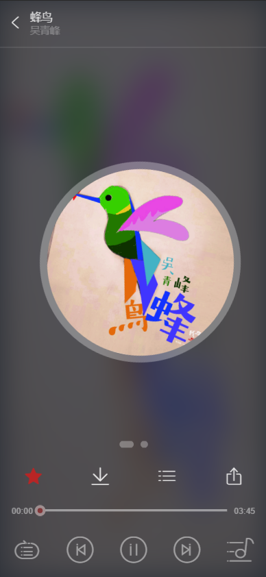
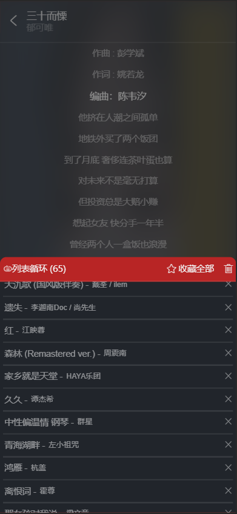

# CloudMusic

通过`Vue`框架开发的仿网易云音乐移动端项目 😘

## 技术栈

1. 网易云音乐 API [Binaryify/NeteaseCloudMusicApi](https://github.com/Binaryify/NeteaseCloudMusicApi)
2. Vue 全家桶
3. axios
4. vue-lazyloader
5. better-scroll

## 功能

* [x] 基本音乐播放功能
* [x] 推荐歌单、音乐的获取
* [x] 登录功能（登录后获取个人歌单）
* [x] 搜索功能（不完善）
* [ ] 排行榜
* [ ] 私人 FM

### 待开发页面

* [ ] 歌手主页 / 专辑主页
* [ ] 评论页
...
## 运行方法

### 将项目和 API 克隆至本地

```
git@github.com:Mmear/CloudMusic.git
git@github.com:Binaryify/NeteaseCloudMusicApi.git
```

### 安装依赖并运行 API 服务

```
cd .\NeteaseCloudMusicApi\
npm run install
node .\app.js
```

### 安装本项目依赖

```
cd .\CloudMusic\
npm run install
```

### 运行 or 构建

```
npm run serve // visit http://localhost:8080
npm run build
```

## 页面展示






